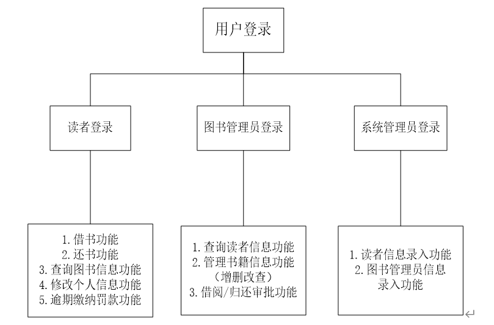
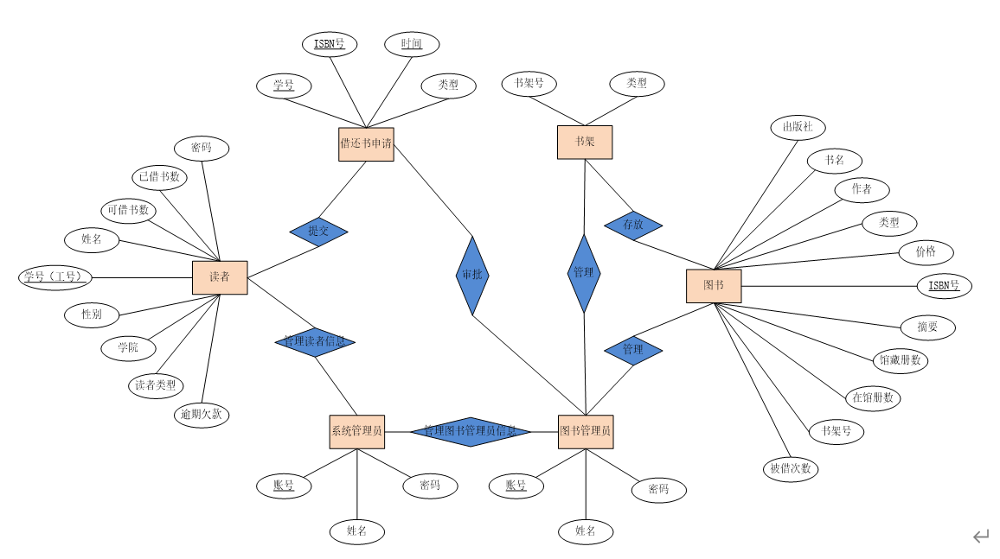
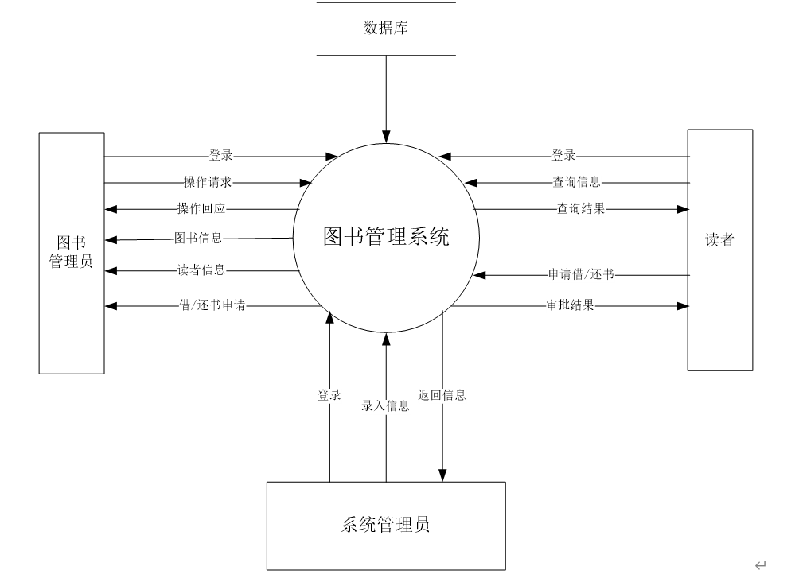
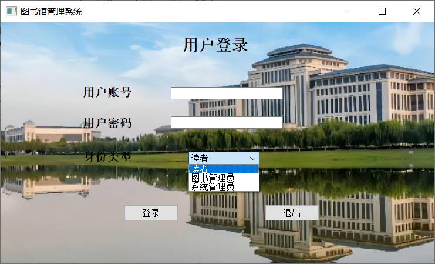
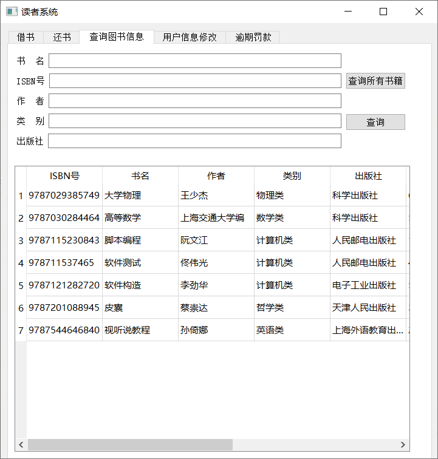

# DB_Library
## 图书管理系统
基于python实现的图书管理系统。
### 功能图

### 开发环境
* Visio画图工具：制作E-R实体关系图，数据流图和数据字典等图示；
* MySQL：创建数据库，数据表进行后台存储；
* Pycharm：使用python语言对系统进行编写；
* Qt designer：图形界面设计工具，用于设计界面并自动生成代码。
## 系统设计
### E-R图

### 顶层数据流图

## 实现效果
### 登录

### 主界面

